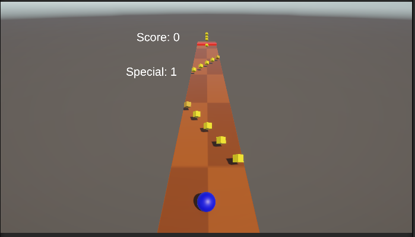

# unity-gaming-campus

Version 1.0: 20251024

Si vous êtes de GamingCampus, vous pouvez trouver une présentation détaillée du rojet dans Presentation_InfiniteRunner.pdf.

# English Version (french below)

---

This project was coded for Unity. In order to try it, create a new unity project (we'll code it InfiniteRunner) and put the code from this git in the InfiniteRunner folder.

## Description

### Presentation

This project is an infiniteRunner. The player's objective is to grab as many grains and get as far as possible without dying. You can see the player screen in the screenshot right under:

### Controls

The player can control the blue sphere with the arrow keys (he can go left and right, the level moves automatically). Press the **space bar** to jump and the **enter key** to activate his special power (the number of special powers left is indicated with "special" on the left-hand side of the screen).
The player must collect corn (yellow and orange cubes) to increase his score.
The player must avoid obstacles (red rectangles).

### Progression

Depending on the number of corn the player has collected, the player changes state and gains new aptitudes and new special powers. Aptitudes are new moves for the player and can be used whenever in game, special powers need special power charges to be activated and last for 10 s. Players gain a special power charge when changing state.

**Whenever the player changes state, the level speeds up**.

| Corn Collected | Special Power | Aptitudes |
|---|---|---|
|0 | Shield (player can withstand 1 blow) | N/A |
|50 | Slow Down (divides speed of the game by 2) | N/A |
|100 | Slow Down (divides speed of the game by 2) | Glide (hold the jump button to glide in the air up to three seconds) |
|250 | Slow Down (divides speed of the game by 2) | Double jump |
|500 | Slow Down (divides speed of the game by 2) | Dash (hold e and a direction to dash in that direction) |
|1000 | Slow Down (divides speed of the game by 2) | N/A |

## File Descriptions

### Overview

The main folder for this repository is **Assets**. It contains the following elements:
- Events: Contains all scriptable objects.
- Materials: Contains all materials.
- Resources: Contains all Prefabs depending on their type.
- Scenes: Contains all our game scenes (MainMenu, our level, the game overscreen and a test scene to test our level chunks and movement).
- Scripts: Contains our code.

### Focus on our Scripts

Let's have a look at our Scripts. Our scripts folder contains the following folders:
- Camera: Scripts to handle how our camera moves depending on player movement.
- Components: Scripts to handle the components of a scene (level chunks, obstacles and collectibles). Also handles how chunks spawn and are destroyed. Chunks are chosen at random from the Chunks prefabs.
- Menus: Scripts to define our menus.
- Player: Scripts to define how our player moves, how to update the score, handle state change, health and all player-related elements. 
- ScriptableObjects: Scripts to define our Scriptable Objects.
- Services: Scripts to handle transversal services (gameover and singletons).

Have a great day!

---

# Version française

---

Ce projet a été codé pour Unity. Si vous souhaitez l'utiliser, créez un nouveau projet unity (appelons le InfiniteRunner) et mettez le code de ce repository dans le dossier InfiniteRunner.

## Description

### Presentation

Ce projet est un Infinite Runner le but du jeu est de récupérer le score le plus élevé possible sans mourir. Vous pouvez voir ci-dessous un écran de jeu :

### Comment jouer ?

Le joueur peut controler la sphère bleue avec les flèches directionnelles (il peut se déplacer de droite à gauche, le niveau défile tout seul). Le joueur peut **sauter en appuyant sur la barre d'espace** et **activer son pouvoir spécial en utilisant la touche entrée**. Le nombre de charge de pouvoi du joueur est indiqué à l'écran à gauche.
Le joueur peut collecter des grains (les cubes jaune) pour augmenter son score.
Le joueur doit éviter les obstacles rouges.

### Progression

En fonction du nombre de grains que le joueur a collecté, il change d'états et débloque de nouveaux pouvoirs spéciaux et des aptitudes. Un pouvoir spécial remplace le précédent et nécessite une charge afin d'être activé, une aptitude est une capacité que le joueur peut activer à tout moment et qui vient enrichir son arsenal. Les pouvoirs spéciaux sont actifs pendant 10s, le joueur gagne une charge de pouvoir spécial à chaque fois qu'il change d'état.

**A chaque changement d'état, le niveau s'accélère.**.

| Grains collectés | Pouvoirs spéciaux | Aptitudes |
|---|---|---|
|0 | Bouclier (Le joueur peut survivre à un obstacle) | N/A |
|50 | Ralentissement (La vitesse du niveau est divisée par 2) | N/A |
|100 | Ralentissement (La vitesse du niveau est divisée par 2) | Planer (En maintenant la barre d'espace, le joueur peut planer dans les airs jusqu'à 3 secondes) |
|250 | Ralentissement (La vitesse du niveau est divisée par 2) | Double saut |
|500 | Ralentissement (La vitesse du niveau est divisée par 2) | Dash (appuyer sur la touche e et une direction pour faire un dash dans cette direction) |
|1000 | Ralentissement (La vitesse du niveau est divisée par 2) | N/A |

## Description des fichiers

### Vue d'oiseau

Le dossier principale de ce repository est le dossier Assets. Il contient les éléments suivants :
- Events : contient tous les scriptable objects.
- Materials : contient tous les matériaux.
- Resources : contient tous les prefabs.
- Scenes : contient toutes les scènes de jeu (mainmenu, game over et scène de niveau. Contient aussi un niveau de test afin de créer et tester des chunks).
- Scripts : contient tout le code du jeu.

### Focus sur les scripts

Notre dossier Scripts contient les éléments suivants :
- Camera : Scripts pour gérer les mouvements de la caméra en fonction du joueur.
- Components : Script pour gérer les éléments constitutifs d'une scène (chunks, collectibles, obstacles). Gère le spawn et la destruction des Chunks. Les chunks sont choisis au hasard en piochant dans les prefabs à disposition.
- Menus : Scripts pour définir les menus.
- Player : Scripts pour définir les mouvements du joueur, la mise à jour des scores, la gestion de la santé, le changement d"état du joueur et tous les éléments liés au joueur. 
- ScriptableObjects : Scripts pour définir nos scriptableObjects
- Services : Scripts gérant les services transverses (Gestion des GameOver et singletons).

Passez une excellente journée !
